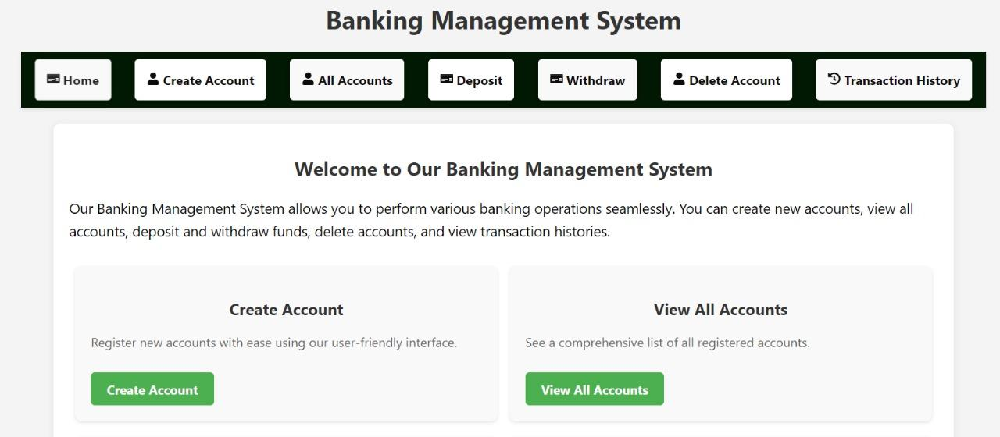

# 🏦 Banking Management System

A full-stack **Banking Management System** built using **Spring Boot**, **ReactJS**, and **MySQL**. This project allows users to manage bank accounts with features like account creation, deposit, withdrawal, transaction history, and account deletion through a user-friendly interface.


*(Replace with actual screenshots)*

## 🚀 Features

- ✨ Create, view, and delete bank accounts
- 💰 Deposit and withdraw money
- 📊 View transaction history and account details
- 🔍 Search and filter accounts
- 📱 Responsive and interactive UI
- 🔒 Secure REST API backend
- 🗃️ MySQL database integration

## 🛠️ Tech Stack

### Frontend
- ReactJS
- React Router DOM
- Axios (for API calls)
- React Icons
- CSS

### Backend
- Java 11+
- Spring Boot 2.7+
- Spring Data JPA
- MySQL 8.0+

## 📂 Project Structure


## 🚀 Getting Started

### Prerequisites
- Java JDK 11+
- Node.js 14+
- MySQL 8.0+
- Maven

### 🛠️ Backend Setup (Spring Boot)

1. **Clone and navigate**:
   ```bash
   git clone https://github.com/your-username/banking-system.git
   cd banking-system/backend

2. **Configure database (src/main/resources/application.properties):**:
   ```bash
   spring.datasource.url=jdbc:mysql://localhost:3306/bankdb
   spring.datasource.username=your_db_username
   spring.datasource.password=your_db_password
3. **Build and run:**:
   ```bash
   mvn clean install
   mvn spring-boot:run
### Backend Server starts at http://localhost:8080

### Frontend Setup (React.js)

1. **Navigate to frontend folder**:
   ```bash
   cd ../frontend
2. **Install Dependencies**:
   ```bash
   npm install
3. **Configure environment (create .env file)**:
  ```bash
  REACT_APP_API_BASE_URL=http://localhost:8080/api


